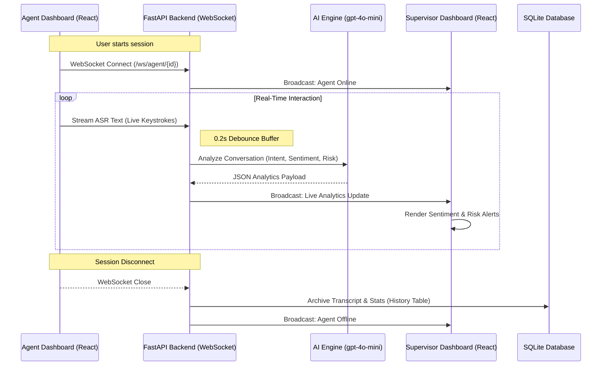

#  AWETALES SENTINEL - Real-Time ASR Analytics

A real-time conversation analytics module that processes streaming ASR text to analyze live conversations, detect intent, classify topics, identify sentiment, and monitor escalation risk dynamically.

## 📊 System Flow Diagram
The following diagram illustrates the real-time data flow between the Agent, Backend, AI Engine, and Supervisor.



---

## 👥 TEAM INFO
- **Akshay Kumar** (2420030604) [2420030604@klh.edu.in]
- **Charan** (2420090029) [2420090029@klh.edu.in]
- **Bhuvan S** (2420030135) [2420030135@klh.edu.in]

---

## 1. HOW WE MET THE SPECIFIC REQUIREMENTS
The Hackathon explicitly requested 4 analytical components extracting insights from "streaming ASR". 

Our architecture completely fulfills these using a highly optimized pipeline:
- **Intent Detection**: Our LLM dynamically analyzes text (identifying Billing, Support, General concepts) as valid JSON fields "intent" and "topic".
- **Topic Classification**: Explicit topics are extracted per the system prompt matching the problem statement requested fields.
- **Sentiment Analysis**: The incoming stream is categorized distinctly into "Positive", "Neutral", or "Negative", rendered visually for Directors.
- **Escalation Risk Detection**: We map specific key phrases (e.g., "I need a manager") into "low", "medium", or "high" escalation identifiers alerting the remote Supervisor Dashboard dynamically.

---

## 2. WHY OUR PROTOTYPE STANDS OUT
Most prototypes built for this hackathon will be single-screen inputs that mock an API call *after* a conversation is over. AweTales Sentinel is explicitly built differently:

1. **True Real-Time (Bi-Directional WebSockets)**: 
We don't wait for "submit" buttons. As the Agent types (simulating ASR text blocks arriving), keystrokes are streamed immediately through FastAPIs WebSockets.

2. **Lightning LLM Inference (0.2s Latency Buffers)**:
Language models are slow; streaming real-time analytics requires extreme speed. We implemented a 0.2s debounce buffer on the backend. This aggregates micro-text inputs before hitting our inference layer, drastically reducing API spam while maintaining sub-second updates on the Supervisor Dashboard. We also constrained our `gpt-4o-mini` max_tokens to 60 for near-instant inference.

3. **Complete "Enterprise" Multi-Role Polish**:
We built a dual-sided Multi-Role architecture. 
- The `Agent Dashboard` acts purely as the customer-service agent, feeding the ASR stream. 
- Handled via pure WebSocket Pub/Sub structure, **entirely separate** `Supervisor Dashboards` receive live payload changes from active agents on the floor, perfectly mimicking reality.
- We even included an **AI Auto-Responder** that simulates the dynamic, unpredictable replies of a customer instead of relying on a hard-coded text script.
- All sessions are persistently archived to an SQLite **history** database when the WebSocket safely closes.

---

## 3. TECHNICAL ARCHITECTURE
### FRONTEND
- **Framework**: React + Vite + Tailwind CSS + Framer Motion
- **Routing**: `react-router-dom` handling protected routes and multi-view rendering.
- **Responsibilities**: Manages the Web Speech API (if activated), handles WebSocket initialization, parsing incoming JSON streams, rendering the Director Analytics charts, and formatting the Glassmorphism UI. 

### BACKEND 
- **Framework**: Python + FastAPI + Uvicorn 
- **Database**: SQLite3 for `users` and session `history` persistence
- **Responsibilities**: Manages the `ConnectionManager` routing standard WebSocket connections alongside broadcasting data to pure listener clients (Supervisors). Exposes standard REST points for Auth and AI Reply generation.

### AI ENGINE
- **Model**: `gpt-4o-mini`
- **Provider**: Azure AI Inference API (GitHub Models Infrastructure)
- **Responsibilities**: Performs rapid classification based on a strict structural system prompt heavily biased toward returning highly structured JSON data strings.

---

## 4. INSTALLATION & USAGE
To run this project locally on your machine:

### 1. Requirements:
- Python 3.10+
- Node.js & npm 
- A GitHub Personal Access Token (for Azure AI)

### 2. Backend Setup:
```bash
cd awetales-sentinel
pip install -r requirements.txt
# Ensure an environment variable OPENAI_API_KEY is set to your GitHub PAT.
uvicorn main:app --reload
```

### 3. Frontend Setup:
```bash
cd awetales-sentinel
npm install
npm run dev
```

### 4. Navigating the App:
- Open `http://localhost:5173` 
- Choose "Register" from the Login Screen.
- Register an account as an **Agent** and **Supervisor**.
- Log into `/agent` and begin typing a mock customer complaint.
- In a separate browser window, log into `/supervisor` to view the analytics generating in real-time.
