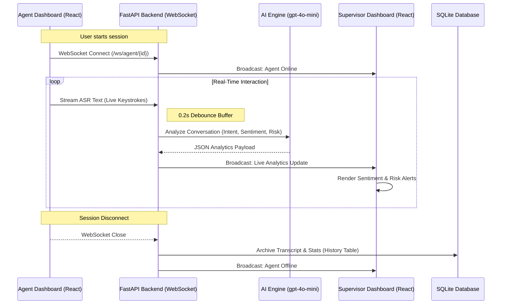

# AweTales Sentinel - System Flow Diagram

The following diagram illustrates the real-time data flow between the Agent, Backend, AI Engine, and Supervisor.

---

## 🏗 High-Level Architecture
1. **Frontend**: React-based UI with Framer Motion for premium "glassmorphism" aesthetics.
2. **Streaming**: Bi-directional WebSockets for zero-latency communication.
3. **Intelligence**: GPT-4o-mini performing sub-second categorical inference.
4. **Persistence**: SQLite storage for audit trails and account management.
